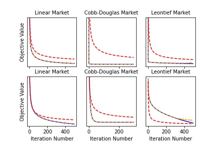

# Requirements

## Programming Languages
- R version 3.6 and above 
- Python 3.7

## Python Libraries
To install python requirements run the following command
```
pip install -r requirements.txt
```

## R Libraries

The R libraries to included are run by the code but in case of version failure, the libraries needed are:

- tidyverse
- stests

# Running Experiments, Obtaining Graph and Statistical Tests

To run the experiments and obtain the associated graphs and statistical test results, run the following:

```
python test.py
Rscript dataAnalysis.R
```
# Results

The first row describes the average trajectory of the value of the objective function for a randomly initialized market on each iteration of both the max oracle algorithm (in  blue) and the nested gradient ascent descent (in orange) when the starting prices are high, while the second row describes the average trajectory of the objective function when starting prices are low for linear, Cobb-Douglas, and Leontief Fisher markets respectively. The dashed red line represents a convergence rate of 1/sqrt(T)

